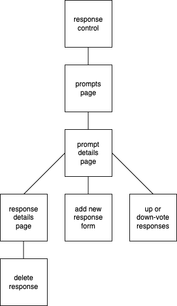

# Can We Talk?

#### By E. Luckie ☀️

#### This web application is a vote-based discussion forum. Users are able to add posts to the forum in response to prompts, and up or down-vote other posts. The amount of up-votes on a post determines how high up the page it is displayed.

[Click here](https://eluckie.github.io/can-we-talk/) to view the live version of this forum discussion webpage.

## Technologies Used

* React
* Redux
* JavaScript
* HTML
* CSS
* Markdown
* Git

## Prompt Description

Recreate a basic subreddit and/or vote-based discussion board using React and Redux. Here are some user stories to get you started:

* As a user, I want to enter content into a form and submit to create a new post.
* As a user, I want my new posts to include a timestamp. And I want to see when other listings were posted, too.
* As a user, I want to upvote posts I particularly enjoy.
* As a user, I want to downvote posts I don't like, or find inappropriate.
* As a user, I'd like posts with the most upvotes to appear higher on the page. (We haven't explicitly covered this in our curriculum, but here's a hint: You can complete logic before the ``return`` statement of a ``mapStateToProps()`` method!)

##

Start by taking the first class session(s) to focus on understanding Redux state management and following the flow of data between React and Redux. Practice combining reducers.

Then take the next class session(s) to add action creators and constants.

Then, take the remaining class session(s) to put the finishing touches on your project and consider experimenting with lifecycle methods.

## Diagrams

#### Site Diagram

#### Component Diagram

## Setup/Installation Requirements

1. Clone this repository to your desktop
2. Navigate to the top level of this directory in your computer’s terminal, called ``can-we-talk``
3. Run the code ``npm install`` in your terminal to install the necessary packages and plug-ins
4. Run the code ``npm run start`` in your terminal to start the application and open the project in your web browser

## Known Bugs

* No known bugs.

## Stretch Plans

* As a user, I'd like posts with the most upvotes to appear higher on the page. (We haven't explicitly covered this in our curriculum, but here's a hint: You can complete logic before the ``return`` statement of a ``mapStateToProps()`` method!)

## License

MIT License

Copyright (c) 2023 Luckie

__________

This project was bootstrapped with [Create React App](https://github.com/facebook/create-react-app).